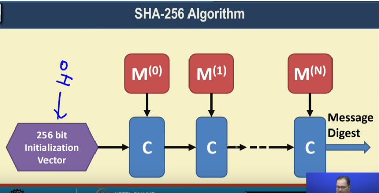

SHA 256
  * Let M be the message.
  I.   
    1. If M mod 512 isn't 0 , append 1
    2. Then append k zeroes, such that M+1+k is an integral multiple of 448.
    3. Add 64 bits of M in binary.
    4. Divide into 512 bit blocks (if possible)
    5. Further divided into 32 bit sub-blocks
      * M 0(i) , M 1(i),........ M 15(i).

  II.
    1. Take initial hash H0.
    2. Calculate using formula
      * H(i) = H(i-1) + C( H(i-1) )
      * C is compression function. (Does stuff)
      * Addition is mod 2^32 addtion.

      

* Hash Pointer : Pointer to where
  * Message is stored.
  * Hash of message is stored
